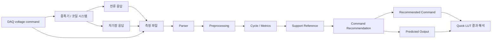

# COil Analyzing 개발 목적 및 구현 전략 보고서

## 1. 보고서 개요

이 보고서는 `COil Analyzing` 프로젝트가 어떤 문제를 해결하기 위해 만들어졌고, 현재 어떤 데이터 처리 전략과 알고리즘으로 코일 측정 데이터를 분석하는지 설명하는 정식 보고자료이다. 이 문서는 발표 슬라이드나 PR 리뷰 문서가 아니라, 비전공자와 실무자가 프로젝트의 목적, 분석 흐름, 구현 원리, 최신 상태를 문서 형태로 이해할 수 있도록 작성되었다.

프로젝트의 핵심 문제는 다음과 같다.

> 원하는 자기장 파형은 정의할 수 있지만, 그 파형을 만들기 위해 DAQ에 어떤 전압 command를 넣어야 하는지는 직접 알기 어렵다.

실제 실험에서는 DAQ 입력 전압이 증폭기와 코일을 거쳐 자기장으로 변환된다. 이 과정에서 코일 특성, 증폭기 한계, 센서 기준선, 측정 노이즈, 시작/종료 순간의 transient가 영향을 준다. 따라서 단순히 “목표 파형과 같은 전압 파형”을 넣는 방식으로는 원하는 자기장 출력이 보장되지 않는다.

최신 브랜치 기준으로 프로젝트는 다음 흐름을 갖춘 분석/운용 도구로 발전하고 있다.

- 측정 파일을 읽고 파일명과 metadata를 해석한다.
- raw waveform과 corrected waveform을 비교해 데이터 품질을 검수한다.
- 입력 전압과 출력 자기장의 관계를 support reference로 정리한다.
- field-only 기준의 목표 자기장 파형에 대해 DAQ 입력 전압 command 후보를 계산한다.
- Quick LUT 화면에서 목표, 참고 데이터, 추천 command, 예상 출력을 분리해 해석한다.
- finite-cycle과 actual-drive feedback 기반 보정 흐름은 개발 중인 확장 기능으로 다룬다.

이 보고서를 통해 독자는 다음을 이해할 수 있다.

- 왜 코일 분석 자동화가 필요한지
- 입력 데이터가 어떤 절차를 거쳐 분석 가능한 정보가 되는지
- 어떤 알고리즘이 어떤 역할을 하는지
- 결과 그래프와 추천 command를 어떻게 해석해야 하는지
- 현재 구현된 부분과 추가 검증이 필요한 부분이 무엇인지

확인 기준은 로컬 최신 브랜치 `codex/finite-feedback-cycle-policy-backend`이다. 일부 기능은 원격 `main`에 병합된 확정 기능이 아니라 현재 브랜치에서 개발 중인 기능이므로, 본 보고서에서는 “구현됨”, “개발 중”, “검증 필요”를 구분해 서술한다.

## 2. 프로젝트 배경과 개발 목적

### 2.1 왜 코일 분석이 필요한가

코일은 전류가 흐르면 자기장을 만든다. 하지만 실험에서 중요한 것은 코일에 전류가 흐른다는 사실보다, 사용자가 원하는 자기장 waveform이 실제로 만들어지는가이다. 예를 들어 rounded triangle 형태의 자기장을 만들고 싶을 때, DAQ에 같은 모양의 전압을 넣는다고 자기장이 그대로 rounded triangle으로 나오지는 않는다.

그 이유는 입력과 출력 사이에 여러 요소가 있기 때문이다.

- DAQ 전압은 증폭기를 거쳐 코일에 전달된다.
- 코일과 증폭기는 주파수와 파형에 따라 다르게 반응한다.
- 자기장 센서는 기준선, 부호 방향, 노이즈, clipping 영향을 받을 수 있다.
- finite-cycle처럼 짧은 command에서는 시작과 종료 순간의 transient가 크게 나타날 수 있다.

따라서 코일 분석은 그래프를 단순히 보는 일이 아니라, 입력 전압과 실제 자기장 출력 사이의 관계를 정리하고, 원하는 출력에 가까워지기 위한 입력 command를 추정하는 작업이다.

### 2.2 수작업 분석의 한계

수작업 분석에서는 다음과 같은 문제가 반복된다.

| 수작업 단계 | 발생 가능한 문제 | 결과 영향 |
|---|---|---|
| 측정 파일 열기 | 파일명, 조건, cycle 수를 잘못 해석 | 잘못된 support 선택 |
| 컬럼 확인 | 전압, 전류, 자기장 축 혼동 | 분석 대상 오류 |
| 그래프 육안 확인 | spike, clipping, baseline drift를 놓침 | 모델링 왜곡 |
| 파형 비교 | target/support/predicted/command 의미 혼동 | 결과 해석 오류 |
| command 산출 | 장비 한계 반영 누락 | 실행 불가능한 command 생성 |

프로그램화가 필요한 이유는 수작업을 단순히 줄이기 위해서만이 아니다. 같은 기준으로 데이터를 정리하고, 같은 방식으로 검수하며, 결과 해석에 필요한 정보를 일관되게 보여주기 위해서이다.

### 2.3 프로젝트가 해결하려는 핵심 문제

이 프로젝트는 기존 측정 데이터에서 `입력 전압 -> 출력 자기장` 관계를 정리한다. 사용자가 원하는 Physical Target(목표 자기장 파형)을 입력하면, 프로그램은 비교 가능한 Support Reference(참고 측정 데이터)를 찾고, 그 관계를 이용해 Recommended Command(DAQ 입력 전압 후보)를 계산한다.

최종 목표는 다음 네 가지를 한 흐름에서 확인할 수 있게 하는 것이다.

- 목표 자기장 파형이 무엇인지
- 어떤 측정 데이터가 계산에 참고되었는지
- DAQ에 넣을 전압 command 후보가 어떤 형태인지
- 그 command를 적용했을 때 예상되는 자기장 출력이 목표와 얼마나 가까운지

Recommended Command는 정답이 아니라 측정 데이터 기반 후보이다. 실제 운용 판단은 Raw Waveforms 검수, support 조건 확인, predicted output 비교, 추가 측정 검증을 함께 보고 내려야 한다.

## 3. 분석 대상과 기본 개념

### 3.1 코일과 프로젝트 내 분석 대상

일반적으로 코일은 감긴 도선이며, 전류가 흐르면 자기장이 발생한다. 이 프로젝트에서 코일은 회로 도면상의 부품보다, 입력 전압에 대해 전류와 자기장으로 반응하는 실험 시스템으로 다뤄진다.

코드에서 확인되는 주요 채널은 다음과 같다.

| 구분 | 예시 채널 | 의미 |
|---|---|---|
| 입력 전압 | `daq_input_v`, `command_voltage_v`, `recommended_voltage_v`, `limited_voltage_v` | DAQ 또는 추천 command 전압 |
| 전류 | `coil1_current_a`, `coil2_current_a`, `i_sum`, `i_diff`, `i_sum_signed` | 코일 전류 또는 조합 전류 |
| 자기장 | `bx_mT`, `by_mT`, `bz_mT`, `bmag_mT`, `bproj_mT` | 센서로 측정한 자기장 |

실제 코일의 물리적 개수, 배선 구조, 센서의 공간 배치는 코드만으로 확정할 수 없다. 이 부분은 별도 실험 장비 문서가 필요하다.

### 3.2 입력 데이터

입력 데이터는 CSV, TXT, Excel 형식의 측정 파일이다. 프로젝트는 continuous 데이터와 finite-cycle 데이터를 구분한다.

- continuous 데이터: 반복 파형이 일정 시간 지속되는 steady-state 분석용 데이터
- finite-cycle 데이터: 1, 1.25, 1.5, 1.75 cycle처럼 짧은 command 구간을 분석하는 transient 데이터

파일명 규칙은 metadata 추론에 사용된다.

```text
continuous_{waveform}_{freq}Hz.csv
finite_{waveform}_{freq}Hz_{cycle}cycle.csv
```

예를 들어 `continuous_sine_1Hz.csv`는 1 Hz sine continuous 데이터로, `finite_triangle_2Hz_1.75cycle.csv`는 2 Hz triangle 1.75 cycle 데이터로 해석될 수 있다.

### 3.3 주요 용어

| 용어 | 일반적 의미 | 이 프로젝트에서의 의미 |
|---|---|---|
| Noise | 원하지 않는 흔들림 | 센서/측정 과정에서 생긴 불필요한 변동 |
| Baseline | 기준선 | 신호가 0이어야 할 때 실제로 가리키는 기준값 |
| Spike | 순간적으로 튀는 값 | 인접 샘플 jump가 큰 이상 후보 |
| Clipping | 신호 포화/잘림 | 장비 한계로 신호가 잘린 상태 |
| PP | 최대-최소 차이 | 전압, 전류, 자기장 크기 비교 기준 |
| Drift | 반복 중 변화 | cycle이 반복되며 출력이 안정적인지 보는 지표 |
| nRMSE | 정규화 오차 | 목표와 예측 출력 차이를 scale에 맞춰 표현한 값 |
| Shape correlation | 모양 유사도 | 목표 파형과 예측 파형이 얼마나 비슷한지 보는 값 |

### 3.4 결과 해석의 네 가지 핵심 개념

| 개념 | 뜻 | 주의점 |
|---|---|---|
| Physical Target | 만들고 싶은 목표 자기장 파형 | support나 predicted와 다름 |
| Support Reference | 계산에 참고한 기존 측정 데이터 | 목표 파형 자체가 아님 |
| Recommended Command | DAQ에 입력할 전압 후보 | 자기장 파형이 아니라 입력 전압 |
| Predicted Output | 추천 command 적용 시 예상 자기장 출력 | 실제 측정 결과가 아니라 예측 |

이 네 가지는 보고서 전체에서 같은 의미로 사용한다.

## 4. 전체 개발 과정

### 4.1 문제 정의 단계

초기 개발은 측정 파일을 앱에서 안정적으로 읽고, 분석 결과를 일관된 형식으로 만들 수 있는가에서 출발했다. 이는 단순 실행 환경 준비가 아니라 이후 모든 분석 로직이 사용할 공통 데이터 기반을 만드는 단계였다.

초기 방향은 저장소 실행 안정화, dataset library 연결, recommendation output 구조 정리로 요약된다.

### 4.2 데이터 처리 흐름 구축 단계

다음 단계에서는 측정 파일을 표준 데이터로 변환하는 흐름이 만들어졌다. 파일명 metadata 추론, 컬럼 mapping, raw/corrected 데이터 분리, Raw Waveforms selector 개선이 여기에 해당한다.

이 단계가 필요한 이유는 측정 데이터가 항상 동일한 형식으로 들어오지 않기 때문이다. 파일명과 metadata가 틀리면 support selection이 잘못되고, raw 데이터 문제가 corrected 데이터 문제처럼 보일 수 있다.

### 4.3 분석 로직 구현 단계

데이터 처리 기반이 만들어진 뒤에는 cycle detection, metric 계산, LUT 보간, harmonic inverse compensation 같은 분석 로직이 추가되었다.

핵심 방향은 field-only이다. 여기서 field-only는 전류, gain, hardware, LCR 정보를 무시한다는 뜻이 아니다. main shape selection의 중심을 자기장 출력으로 둔다는 뜻이다. 현재 목표 자기장 shape는 rounded triangle, 목표 자기장 PP는 100pp fixed 기준으로 정리되어 있다.

### 4.4 결과 해석 구조 정리 단계

분석 결과가 계산되더라도 사용자가 의미를 오해하면 실험에 잘못 적용될 수 있다. 따라서 UI와 export 구조에서는 Physical Target, Support Reference, Predicted Output, Recommended Command를 분리하는 방향으로 발전했다.

Raw Waveforms는 데이터 품질을 검수하는 화면이고, Quick LUT는 추천 결과와 예상 출력을 해석하는 화면이다. 이 구분은 UI 개선이면서 동시에 분석 결과를 안전하게 해석하기 위한 장치이다.

### 4.5 최신 진행 상태

최신 브랜치 기준으로 프로젝트는 open-loop 추천에서 feedback 기반 보정으로 확장 중이다.

- open-loop: 기존 측정 support를 이용해 첫 Recommended Command를 계산
- actual-drive review: 실제 실행 결과를 다시 읽어 측정 field와 command를 검토
- feedback correction: target과 실제 measured output의 residual을 이용해 command를 보정
- second modeling: 첫 command와 actual-drive 결과를 바탕으로 두 번째 command 후보를 구성
- continuous steady-state: continuous 데이터에서 안정된 1 cycle을 추출해 review에 활용

이 흐름은 개발 중이며, 모든 조건에서 최종 검증된 운용 기능으로 표현하면 안 된다. 특히 finite feedback은 1.0/1.5 cycle 중심 정책이 확인되며, 1.25/1.75/2.0 cycle은 제한 또는 unsupported로 다뤄진다.

## 5. 사용 전략

프로젝트의 전체 전략은 측정 데이터를 바로 믿지 않고, 단계별로 정리하고 검수한 뒤 모델링에 사용하는 것이다.

| 분석 단계 | 목적 | 입력 | 처리 방식 | 출력 | 의미 |
|---|---|---|---|---|---|
| 입력 데이터 확보 | 측정 파일을 분석 대상으로 가져옴 | CSV/TXT/Excel | 파일명/확장자/metadata 확인 | Parsed measurement | 실험 조건 식별 |
| 데이터 정리 | 공통 형식으로 변환 | raw frame | 컬럼 mapping, 표준화 | normalized frame | 분석 가능한 데이터 구조 |
| 전처리 | 분석 방해 요소 완화 | normalized frame | baseline 제거, sign 보정, smoothing, outlier mask | corrected frame | 신뢰 가능한 비교 준비 |
| 특징 추출 | 의미 있는 수치 계산 | corrected frame | cycle detection, PP/gain/drift 계산 | per-cycle/per-test summary | support 구성 근거 |
| support 구성 | 참고 측정 데이터 정리 | summary/profile | 조건별 support selection | Support Reference | 계산에 사용할 경험적 기준 |
| command 계산 | 목표에 필요한 전압 추정 | target/support | LUT 보간, harmonic inverse | Recommended Command | DAQ 입력 후보 |
| 제한 적용 | 장비 실행 가능성 확인 | command waveform | DAQ/amp limit 적용 | limited voltage, feasibility | 실제 운용 가능성 판단 |
| 결과 해석 | 목표와 예측 비교 | target/predicted/support/command | 그래프, metric, flag 표시 | Quick LUT result | 실무 판단 자료 |

이 전략의 장점은 데이터 품질 문제를 모델 성능 문제와 분리해 볼 수 있다는 점이다. 또한 단순 PP 보간과 shape 기반 harmonic inverse를 함께 사용할 수 있어, 빠른 추정과 파형 기반 보정을 모두 지원한다.

한계도 명확하다. support 데이터가 부족하면 결과 해석이 제한되고, Raw Waveforms에서 품질 문제가 있는 데이터는 모델링을 왜곡할 수 있다. feedback correction은 실제 측정 결과와 timebase 정합성에 크게 의존한다.

## 6. 알고리즘 및 핵심 분석 로직

### 6.0 알고리즘 요약

| 알고리즘/로직 | 하는 일 | 쉬운 비유 | 코일 분석에서의 의미 |
|---|---|---|---|
| 파일명 metadata 추론 | 파일명에서 조건 추출 | 상자 라벨 읽기 | support 조건 식별 |
| baseline 제거 | 기준선 offset 보정 | 저울 0점 맞추기 | 신호 비교 기준 정렬 |
| smoothing/outlier mask | 잡음과 이상치 완화 | 사진의 먼지 제거 | 신뢰 가능한 특징 추출 |
| 시간 지연 추정 | 채널 간 시차 계산 | 노래 싱크 맞추기 | target/predicted 비교 정렬 |
| cycle detection | 반복 주기 분할 | 음악 마디 나누기 | cycle별 metric 계산 |
| LUT 보간 | 측정값 사이 목표값 추정 | 눈금 사이 읽기 | 전압 PP 후보 계산 |
| harmonic inverse | harmonic별 전달관계 역산 | 음역대별 스피커 보정 | shape 기반 command 계산 |
| hardware limit | 장비 한계 반영 | 냄비 용량 확인 | 실행 가능한 command 후보 |
| finite metric | active/terminal/tail 평가 | 목적지 도착 후 흔들림 확인 | 짧은 파형 품질 판단 |
| feedback correction | 실제 실행 오차 반영 | 첫 화살 보고 조준 수정 | 두 번째 command 후보 |

### 6.1 파일명 기반 metadata 추론

#### 왜 필요한가

측정 파일의 조건을 사람이 매번 입력하면 waveform, frequency, cycle count를 잘못 기록할 수 있다. 조건이 틀리면 support selection도 틀어진다.

#### 쉬운 설명

파일명은 실험 데이터의 라벨이다. 택배 상자를 열기 전 송장만 보고 물건 종류를 파악하는 것과 비슷하다.

#### 입력값

CSV/TXT/Excel 파일명, 파일 bytes, schema 설정, metadata override.

#### 처리 과정

1. 파일 확장자가 지원되는지 확인한다.
2. continuous 또는 finite filename pattern과 비교한다.
3. waveform, frequency, cycle count를 추출한다.
4. DAQ ±5V, Gain 100% 같은 기본 metadata를 채운다.
5. 파일 내부 metadata 또는 사용자 override와 병합한다.

#### 출력값

표준 metadata와 normalized measurement frame이 생성된다.

#### 코일 분석에서의 의미

분석 데이터가 어떤 조건에서 측정되었는지 식별하고, support reference 후보로 사용할 수 있는지 판단하는 출발점이다.

#### 장점

측정 파일이 많아질수록 조건 추적성과 반복성이 좋아진다.

#### 한계

파일명이 규칙을 벗어나거나 실제 내용과 모순되면 추론이 틀릴 수 있다. Raw Waveforms 검수가 필요하다.

#### 코드상 근거

`src/field_analysis/parser.py`의 `infer_dataset_filename_metadata`, `parse_measurement_file`

### 6.2 baseline 제거와 corrected waveform 생성

#### 왜 필요한가

센서 기준선이 0에서 벗어나면 실제 자기장 변화량이 왜곡된다.

#### 쉬운 설명

저울에 아무것도 올리지 않았는데 5g이 표시되면, 물건을 재기 전에 0점 조정을 해야 한다.

#### 입력값

normalized frame, baseline 설정값, 전압/전류/자기장 채널.

#### 처리 과정

1. 초기 baseline 구간을 선택한다.
2. 각 채널의 평균 offset을 계산한다.
3. 해당 offset을 전체 신호에서 뺀다.
4. raw frame은 유지하고 corrected frame을 만든다.

#### 출력값

corrected frame, 채널별 offset, preprocessing log.

#### 코일 분석에서의 의미

목표와 예측 출력, support reference를 같은 기준선에서 비교할 수 있게 한다.

#### 장점

간단하고 해석하기 쉬우며 PP와 residual 계산의 기준을 정돈한다.

#### 한계

baseline 구간이 충분하지 않거나 이미 신호가 움직이는 구간이면 잘못된 offset이 적용될 수 있다.

#### 코드상 근거

`src/field_analysis/preprocessing.py`의 `apply_preprocessing`

### 6.3 smoothing과 outlier mask

#### 왜 필요한가

측정 데이터의 순간 잡음과 비정상 튐이 shape 비교와 metric 계산을 왜곡하지 않도록 하기 위해 필요하다.

#### 쉬운 설명

흐린 사진에서 작은 먼지를 지우고 윤곽을 부드럽게 만드는 과정과 비슷하다. 다만 너무 많이 보정하면 실제 윤곽도 바뀔 수 있다.

#### 입력값

corrected frame, smoothing method, smoothing window, outlier z-score threshold.

#### 처리 과정

1. moving average 또는 Savitzky-Golay 방식을 선택한다.
2. 전압, 전류, 자기장 채널에 smoothing을 적용한다.
3. 각 채널의 z-score를 계산한다.
4. threshold를 넘는 값은 분석 mask에서 제외한다.

#### 출력값

smoothed signal, 채널별 mask, `analysis_mask`.

#### 코일 분석에서의 의미

spike나 노이즈가 특징값과 추천 command 계산에 과도하게 영향을 주지 않도록 한다.

#### 장점

노이즈가 있는 실험 데이터에서 안정적인 특징값을 추출하는 데 도움이 된다.

#### 한계

과도한 smoothing은 실제 transient를 약화시킬 수 있다. threshold는 데이터 특성과 sampling rate에 영향을 받는다.

#### 코드상 근거

`src/field_analysis/preprocessing.py`의 `_apply_smoothing`, `_apply_outlier_masks`

### 6.4 cross-correlation 기반 시간 지연 추정

#### 왜 필요한가

전압, 전류, 자기장 신호가 시간적으로 어긋나면 같은 파형도 다르게 보인다.

#### 쉬운 설명

같은 노래 녹음 두 개가 있는데 하나가 조금 늦게 시작했다면, 가장 잘 겹치는 위치로 밀어 맞추는 과정이다.

#### 입력값

reference channel, target channel, time step.

#### 처리 과정

1. 두 신호의 평균을 제거한다.
2. cross-correlation을 계산한다.
3. 상관값이 가장 큰 lag를 찾는다.
4. lag sample을 초 단위로 변환한다.
5. 필요하면 interpolation으로 채널을 이동한다.

#### 출력값

lag_seconds, lag_samples, correlation, aligned signal.

#### 코일 분석에서의 의미

목표와 측정 또는 예측 파형을 시간축 기준으로 더 공정하게 비교할 수 있게 한다.

#### 장점

파형 모양은 비슷하지만 시간만 어긋난 경우에 직관적이고 효과적이다.

#### 한계

신호가 너무 짧거나 거의 일정하면 지연 추정이 불안정하다.

#### 코드상 근거

`src/field_analysis/preprocessing.py`의 `estimate_channel_lags`, `_estimate_single_lag`, `apply_channel_alignment`

### 6.5 cycle detection

#### 왜 필요한가

반복 파형을 cycle 단위로 나눠야 안정성, drift, representative cycle을 계산할 수 있다.

#### 쉬운 설명

긴 음악에서 박자를 찾아 마디별로 자르는 것과 비슷하다.

#### 입력값

time array, reference signal, expected cycle count 또는 manual period.

#### 처리 과정

1. FFT로 주요 주파수를 추정한다.
2. autocorrelation으로 반복 간격을 추정한다.
3. zero crossing으로 상승 기준점을 찾는다.
4. 여러 추정값의 median으로 period를 정한다.
5. expected cycle 수에 맞는 boundary를 선택한다.

#### 출력값

cycle boundary, cycle_index, cycle_progress, estimated frequency.

#### 코일 분석에서의 의미

반복 실험 데이터에서 안정된 cycle과 불안정한 cycle을 구분할 수 있게 한다.

#### 장점

FFT, autocorrelation, zero crossing을 함께 사용해 한 방식이 불안정할 때 보완할 수 있다.

#### 한계

노이즈가 심하거나 반복이 충분하지 않으면 cycle boundary가 흔들릴 수 있다.

#### 코드상 근거

`src/field_analysis/cycle_detection.py`의 `estimate_period_seconds`, `select_cycle_boundaries`, `detect_cycles`

### 6.6 PP, gain, drift 특징 추출

#### 왜 필요한가

그래프를 눈으로만 보는 대신 정량 비교가 가능한 특징값을 만들기 위해 필요하다.

#### 쉬운 설명

운동 기록을 “잘했다”라고만 하지 않고 최고 속도, 평균 속도, 기록 변화량을 숫자로 적는 것과 같다.

#### 입력값

cycle index가 붙은 annotated frame, current channel, main field axis.

#### 처리 과정

1. cycle별 데이터를 분리한다.
2. 전압, 전류, 자기장 채널의 최대/최소/RMS를 계산한다.
3. PP를 `max - min`으로 계산한다.
4. `Bmag = sqrt(Bx^2 + By^2 + Bz^2)`를 계산한다.
5. field gain과 cycle drift를 계산한다.

#### 출력값

per-cycle summary와 per-test summary.

#### 코일 분석에서의 의미

support selection, coverage 판단, 데이터 품질 비교에 필요한 기본 수치가 된다.

#### 장점

실험 조건별 비교와 검수 기준을 정량화할 수 있다.

#### 한계

cycle detection이 틀리면 특징값도 함께 틀릴 수 있다.

#### 코드상 근거

`src/field_analysis/metrics.py`의 `compute_cycle_and_test_metrics`, `build_calculation_details`

### 6.7 LUT 보간 기반 command 추정

#### 왜 필요한가

기존 측정 데이터에서 목표 자기장 PP에 필요한 전압 크기를 빠르게 추정하기 위해 필요하다.

#### 쉬운 설명

온도계 눈금 사이 값을 읽는 것과 비슷하다. 측정된 지점 사이에서 목표값에 필요한 전압을 추정한다.

#### 입력값

per-test summary, waveform type, frequency, target metric, target value.

#### 처리 과정

1. field-only target metric을 선택한다.
2. waveform과 frequency 조건에 맞는 support subset을 찾는다.
3. target value 주변 support point를 찾는다.
4. 보간 또는 제한된 외삽으로 estimated voltage/current/field를 계산한다.
5. 대표 voltage template을 선택해 전압 PP에 맞게 scale한다.

#### 출력값

estimated voltage PP, command waveform, support table, template waveform.

#### 코일 분석에서의 의미

측정된 조건 사이에서 목표 자기장 크기에 필요한 DAQ 입력 전압 후보를 빠르게 얻는다.

#### 장점

측정 데이터 기반이라 직관적이고 빠르며 실무자가 이해하기 쉽다.

#### 한계

support 범위 밖 외삽은 위험하다. 파형 shape까지 충분히 설명하려면 harmonic inverse가 필요하다.

#### 코드상 근거

`src/field_analysis/lut.py`의 `recommend_voltage_waveform`, `_interpolate_metric`

### 6.8 FFT 기반 harmonic inverse compensation

#### 왜 필요한가

목표 자기장 파형의 shape를 맞추기 위해, 파형을 harmonic 성분으로 나누고 성분별 전압-자기장 전달관계를 역산한다.

#### 쉬운 설명

원하는 음악 소리를 만들기 위해 저음, 중음, 고음별로 스피커가 얼마나 반응하는지 보고 입력 볼륨을 조절하는 것과 비슷하다.

#### 입력값

Physical Target 파형, support 전압 파형, support 자기장 출력 파형, frequency, harmonic limit.

#### 처리 과정

1. target output에서 평균값을 제거한다.
2. FFT로 target을 harmonic 성분으로 분해한다.
3. support 전압과 support 자기장도 FFT로 분해한다.
4. 각 harmonic에서 전달관계를 계산한다.

```text
H_n = B_support,n / V_support,n
V_recommended,n = B_target,n / H_n
```

5. inverse FFT로 시간 영역의 recommended voltage waveform을 복원한다.

#### 출력값

Recommended Command와 harmonic transfer model.

#### 코일 분석에서의 의미

목표 자기장 shape를 만들기 위해 harmonic 성분별로 필요한 입력 전압을 역산한다.

#### 장점

단순 PP 크기만 맞추는 것이 아니라 파형 shape를 구성하는 성분별 보정이 가능하다.

#### 한계

support 데이터 품질에 민감하다. support 전압 성분이 거의 0인 harmonic은 안정적으로 나눌 수 없다. finite-cycle에서는 exact support 부족 시 해석이 제한된다.

#### 코드상 근거

`src/field_analysis/compensation.py`의 `build_harmonic_transfer_lut`, `_harmonic_inverse_compensation`, `_harmonic_inverse_field_only_compensation`

### 6.9 hardware limit 적용

#### 왜 필요한가

계산된 command가 실제 DAQ와 증폭기 한계를 넘지 않는지 확인하기 위해 필요하다.

#### 쉬운 설명

요리 레시피가 있어도 냄비 용량을 넘으면 그대로 만들 수 없다. 장비가 낼 수 있는 범위 안으로 조정해야 한다.

#### 입력값

recommended voltage waveform, DAQ 최대 PP, amp gain, amp output limit.

#### 처리 과정

1. active 구간의 recommended voltage PP를 계산한다.
2. DAQ 최대 PP를 넘으면 scaling한다.
3. 필요한 amp gain과 amp output PP/PK를 계산한다.
4. DAQ, amp gain, amp output limit 통과 여부를 표시한다.

#### 출력값

limited_voltage_v, required_amp_gain_pct, within_hardware_limits.

#### 코일 분석에서의 의미

계산상 가능한 command와 실제 장비에서 실행 가능한 command를 구분한다.

#### 장점

실험 전에 장비 한계 초과 가능성을 확인할 수 있다.

#### 한계

현재 모델은 제한값 중심이다. 실제 증폭기 비선형성 전체를 완전히 설명한다고 볼 수는 없다.

#### 코드상 근거

`src/field_analysis/hardware.py`의 `apply_command_hardware_model`

### 6.10 finite-cycle metric 평가

#### 왜 필요한가

짧은 구간 파형에서는 active window뿐 아니라 종료 지점과 tail residual이 중요하다.

#### 쉬운 설명

자동차가 목적지까지 잘 갔는지만 보는 것이 아니라, 멈출 때 얼마나 흔들렸는지도 보는 것과 같다.

#### 입력값

command profile, target column, predicted column, time column, active mask.

#### 처리 과정

1. active 구간의 target과 predicted를 추출한다.
2. RMSE와 nRMSE를 계산한다.
3. shape correlation을 계산한다.
4. terminal peak error, value error, slope direction을 계산한다.
5. tail residual peak와 ratio를 계산한다.
6. target과 predicted의 lag를 추정한다.

#### 출력값

active nRMSE, shape correlation, terminal error, tail residual ratio, lag.

#### 코일 분석에서의 의미

finite-cycle에서 실제 문제가 되는 종료부와 잔류 응답을 분리해 볼 수 있다.

#### 장점

active 구간, 종료부, tail을 나누어 검수할 수 있다.

#### 한계

predicted output 자체가 불완전하면 metric도 보조 지표로 해석해야 한다.

#### 코드상 근거

`src/field_analysis/finite_cycle_metrics.py`의 `evaluate_finite_cycle_metrics`

### 6.11 actual-drive feedback correction

#### 왜 필요한가

첫 번째 command를 실제로 실행한 뒤 측정 결과가 목표와 다르면, 그 residual을 이용해 다음 command를 보정하기 위해 필요하다.

#### 쉬운 설명

화살을 한 번 쏴보고 과녁에서 벗어난 방향을 확인한 뒤, 다음 화살의 조준점을 조금 수정하는 것과 같다.

#### 입력값

첫 번째 command profile, 실제 실행 결과 파일, target, measured field, voltage limit.

#### 처리 과정

1. actual-drive 결과를 읽고 target 조건과 timebase를 확인한다.
2. measured field와 actual voltage를 normalize한다.
3. residual = target - measured를 계산한다.
4. residual 비율에 correction gain과 voltage limit을 곱해 correction delta를 만든다.
5. smoothing과 clipping을 적용한다.
6. corrected voltage를 새 command 후보로 표시한다.

#### 출력값

feedback_corrected_limited_voltage_v, correction_delta_v, feedback metadata.

#### 코일 분석에서의 의미

실제 실험 결과를 다음 command에 반영하는 feedback형 운용으로 확장할 수 있다.

#### 장점

open-loop 추천에서 실제 측정 결과 기반 보정으로 확장할 수 있다.

#### 한계

현재 최신 브랜치에서 개발 중인 흐름이다. production cycle policy가 1.0/1.5 cycle 중심으로 제한되어 있으며, forward prediction이 없으면 corrected command의 predicted output을 표시하지 못할 수 있다.

#### 코드상 근거

`src/field_analysis/finite_feedback_peak_correction.py`의 `apply_finite_feedback_peak_correction`, `src/field_analysis/finite_second_modeling.py`의 `generate_second_modeled_voltage_lut`

## 7. 토폴로지와 데이터 흐름

여기서 토폴로지는 소프트웨어 아키텍처가 아니라, 코일 데이터가 분석 결과로 바뀌는 관계 구조를 의미한다.

### 7.1 open-loop 추천 흐름



open-loop 흐름에서는 기존 측정 데이터를 기반으로 첫 command 후보를 계산한다. 이때 실제 새 실험 결과는 아직 반영되지 않는다.

### 7.2 feedback 확장 흐름


feedback 흐름은 개발 중인 확장이다. 첫 command를 실제로 실행한 뒤 측정 결과를 다시 읽고, target과 measured output의 차이를 이용해 command를 보정한다.

확인 불가 항목은 다음과 같다.

- 실제 물리 코일의 개수와 배선 구조
- 코일 간 전기적 연결 관계
- 센서의 실제 공간 배치

## 8. 최신 진행사항

### 8.1 기능 상태표

| 구분 | 현재 가능한 내용 | 상태 |
|---|---|---|
| 데이터 입력 | CSV/TXT/Excel 파일 preview/parse | 구현됨 |
| metadata 추론 | continuous/finite-cycle 파일명 해석 | 구현됨 |
| Raw Waveforms | raw/corrected waveform 검수 | 구현됨 |
| 전처리 | baseline, sign, smoothing, outlier, lag 처리 | 구현됨 |
| 특징 추출 | cycle detection, PP/gain/drift 계산 | 구현됨 |
| Quick LUT | field-only rounded triangle 100pp 기준 추천 | 구현됨 |
| harmonic inverse | support 기반 shape command 계산 | 구현됨 |
| hardware limit | DAQ/amp 제한 반영 | 구현됨 |
| finite metrics | active/terminal/tail 지표 산출 | 구현됨 |
| actual-drive review | 실제 실행 결과 검토 흐름 | 개발 중 |
| feedback correction | residual 기반 command 보정 | 개발 중 |
| second modeling | 두 번째 command 후보 구성 | 개발 중 |
| continuous steady-state | 안정된 1 cycle 추출 | 개발 중 |

### 8.2 현재 제공되는 분석 결과

- Physical Target
- Support Reference
- Recommended Command
- Predicted Output
- hardware feasibility
- finite-cycle metrics
- Raw Waveforms quality checks
- export/debug payload

### 8.3 남은 보완점

- actual-drive feedback과 second modeling은 추가 검증이 필요하다.
- 1.25/1.75/2.0 cycle 정책은 제한적으로 다뤄지며 exact support 확보가 중요하다.
- final LUT export/review 흐름은 실무 검수 절차와 더 명확히 연결할 필요가 있다.
- 실제 회로/코일 물리 토폴로지는 확인 필요이다.

## 9. 결과 해석 방식

### 9.1 최종 결과값

| 결과 | 의미 | 사용자가 볼 점 |
|---|---|---|
| Physical Target | 목표 자기장 파형 | 실제 원하는 출력인지 |
| Support Reference | 참고 측정 데이터 | 목표 조건과 유사한지 |
| Recommended Command | DAQ 입력 전압 후보 | 장비 한계 안에 있는지 |
| Predicted Output | 예상 자기장 출력 | 목표와 얼마나 가까운지 |
| finite metrics | 짧은 파형 품질 지표 | tail/terminal 문제가 있는지 |
| quality flags | 데이터 품질 보조 정보 | 재측정/보류가 필요한지 |

### 9.2 결과값 해석

- voltage PP가 크다: 목표 자기장을 만들기 위해 더 큰 입력 전압이 필요할 수 있다.
- limited voltage가 적용됨: 계산된 command가 DAQ 또는 hardware limit에 의해 줄어들었을 수 있다.
- nRMSE가 크다: target과 predicted 차이가 크다.
- shape correlation이 낮다: 파형 모양이 목표와 다르다.
- tail residual이 크다: command 종료 후 자기장이 남아 있을 수 있다.

### 9.3 결과 해석 체크리스트

| 확인 항목 | 정상적으로 볼 상태 | 주의 또는 재검수 필요 |
|---|---|---|
| Raw waveform | baseline과 tail이 확인 가능 | spike, clipping, flatline |
| Support Reference | 목표 조건과 유사 | exact support 부족 |
| Predicted Output | target과 shape 유사 | early zero, spike, kink |
| Recommended Command | DAQ limit 안에 있음 | 과도한 진폭, 급격한 변화 |
| finite tail | 잔류가 작음 | tail residual이 큼 |
| feedback source | timebase/조건 일치 | freq/cycle mismatch |

Predicted Output은 실제 측정 결과가 아니다. Recommended Command는 후보이며, 실제 실험에서는 추가 검수와 재측정이 필요할 수 있다.

## 10. 개발 과정에서의 주요 개선점

### 10.1 데이터 처리 안정성 개선

기존에는 측정 파일 조건과 컬럼을 사람이 직접 해석해야 했다. 현재는 파일명 metadata 추론, schema mapping, source type 구분, Raw Waveforms selector label 개선을 통해 데이터 조건을 더 안정적으로 확인할 수 있다.

### 10.2 분석 모델링 방향 개선

전류, gain, hardware 조건과 목표 자기장 shape 해석이 섞일 수 있었던 문제를 field-only, rounded triangle, 100pp fixed 기준으로 정리했다. 그 결과 Quick LUT에서 target/support/predicted/command 의미를 분리해 해석할 수 있다.

### 10.3 finite-cycle 해석 개선

finite-cycle에서는 active 구간만 보면 종료부와 tail 문제를 놓칠 수 있다. 현재는 active, terminal, tail 지표를 분리해 early zero, spike, tail residual 같은 문제를 검토할 수 있다.

### 10.4 feedback 기반 확장

첫 command 실행 후 실제 측정 결과를 다음 command에 반영하는 흐름이 개발 중이다. actual-drive review, residual feedback, second modeling이 이 방향에 해당한다.

## 11. 한계와 향후 개선 방향

### 11.1 데이터 품질 한계

baseline, spike, clipping, timebase mismatch가 있는 데이터는 support reference를 왜곡할 수 있다. Raw Waveforms 검수와 suspect/quarantine/retest 절차가 중요하다.

### 11.2 알고리즘 한계

LUT 보간은 support 범위 안에서는 직관적이지만 범위 밖 외삽은 위험하다. harmonic inverse는 shape 기반 설명력이 있으나 support harmonic 성분과 데이터 품질에 민감하다.

### 11.3 finite-cycle 한계

finite-cycle에서는 exact support 부족, command 종료 후 tail 부족, predicted early stop 같은 문제가 발생할 수 있다. 1.75 cycle은 0.75 cycle과 동일하게 취급하면 안 되며, 동일 조건 support 확보 여부가 중요하다.

### 11.4 feedback 한계

actual-drive feedback은 강력한 확장 방향이지만 개발 중이다. target mismatch, timebase mismatch, forward prediction unavailable 상태를 함께 봐야 한다.

### 11.5 향후 개선 방향

- exact support matrix 보강
- Raw Waveforms 검수 결과의 suspect/quarantine/retest workflow 강화
- actual-drive feedback 실측 검증 확대
- final LUT export/review 흐름과 실무 검수 절차 연결
- 실제 코일/센서/회로 토폴로지 문서화
- 비전공자용 결과 해석 가이드 강화

## 12. 비전공자용 요약

COil Analyzing은 코일 실험 데이터를 사람이 해석 가능한 분석 결과로 바꾸고, 원하는 자기장 파형을 만들기 위한 DAQ 입력 전압 command 후보를 계산하는 도구이다.

코일에 전압을 넣으면 자기장이 생기지만, 실제 자기장은 입력 전압과 같은 모양으로 나오지 않는다. 코일, 증폭기, 센서, 측정 장치가 모두 영향을 주기 때문이다. 그래서 원하는 자기장 파형이 있어도 어떤 전압을 넣어야 할지는 직접 알기 어렵다.

프로그램은 먼저 기존 측정 파일을 읽는다. 파일명과 metadata를 해석하고, raw 데이터와 corrected 데이터를 구분한다. 기준선이 어긋난 부분을 보정하고, 노이즈나 이상 신호가 있는지 확인한다. 그 다음 반복 파형을 cycle 단위로 나누고, 전압·전류·자기장의 크기와 변화량을 계산한다.

이렇게 정리된 측정 데이터는 Support Reference가 된다. 사용자가 원하는 Physical Target과 support 데이터를 비교해, 프로그램은 Recommended Command를 계산한다. 결과 화면에서는 이 command를 넣었을 때 예상되는 Predicted Output도 함께 보여준다.

핵심 알고리즘은 두 가지로 이해할 수 있다. LUT 보간은 기존 측정값 사이에서 필요한 전압 크기를 추정하는 방식이다. FFT 기반 harmonic inverse는 파형을 여러 주파수 성분으로 나누고, 각 성분에서 필요한 전압을 거꾸로 계산하는 방식이다.

현재 최신 상태에서는 입력 데이터 처리부터 추천 command 계산, 예상 출력 비교, 일부 feedback 보정 흐름까지 갖춰져 있다. 다만 결과는 최종 정답이 아니라 측정 데이터 기반 후보이며, 데이터 품질, support 조건, 장비 한계, 추가 실험 검증을 함께 확인해야 한다.

## 13. 근거 자료

| 구분 | 근거 위치 | 보고서에서 사용된 이유 |
|---|---|---|
| 코드 파일 | `src/field_analysis/parser.py` | 파일 입력, metadata 추론, parsing 흐름 근거 |
| 코드 파일 | `src/field_analysis/preprocessing.py` | baseline 제거, smoothing, alignment, outlier mask 근거 |
| 코드 파일 | `src/field_analysis/cycle_detection.py` | FFT/autocorrelation/zero crossing 기반 cycle detection 근거 |
| 코드 파일 | `src/field_analysis/metrics.py` | PP, B magnitude, gain, drift 계산 근거 |
| 코드 파일 | `src/field_analysis/lut.py` | LUT 보간 기반 command 추천 근거 |
| 코드 파일 | `src/field_analysis/compensation.py` | harmonic inverse compensation, finite route 근거 |
| 코드 파일 | `src/field_analysis/hardware.py` | DAQ/amp 제한 적용 근거 |
| 코드 파일 | `src/field_analysis/finite_cycle_metrics.py` | finite active/terminal/tail metric 근거 |
| 코드 파일 | `src/field_analysis/finite_feedback_peak_correction.py` | actual-drive feedback correction 개발 흐름 근거 |
| 코드 파일 | `src/field_analysis/finite_second_modeling.py` | second modeling 개발 흐름 근거 |
| 코드 파일 | `src/field_analysis/continuous_steady_state_extraction.py` | continuous steady-state 1 cycle 추출 근거 |
| 문서 | `README.md` | 저장소 목적, entrypoint, 실행 흐름 근거 |
| 문서 | `docs/모델링_정책.md` | field-only, target/support/predicted/command 의미 근거 |
| 문서 | `docs/데이터_수집_가이드.md` | 파일명 규칙과 측정 조건 근거 |
| 문서 | `docs/Raw_Waveforms_데이터_검수_가이드.md` | 데이터 검수 흐름 근거 |
| 테스트/예제 | `tests/test_lut_field_only_core.py` | field-only Quick LUT 핵심 로직 검증 근거 |
| 테스트/예제 | `tests/test_finite_cycle_metrics.py` | finite metric 계산 검증 근거 |
| 테스트/예제 | `tests/test_continuous_steady_state_extraction.py` | continuous steady-state 추출 검증 근거 |
| 변경 이력 | 원격 `main` 기준 `b9e0ac8` | support provenance 정리 상태 확인 |
| 변경 이력 | 로컬 최신 `a8e79f3` | continuous steady-state Quick LUT 흐름 확인 |
